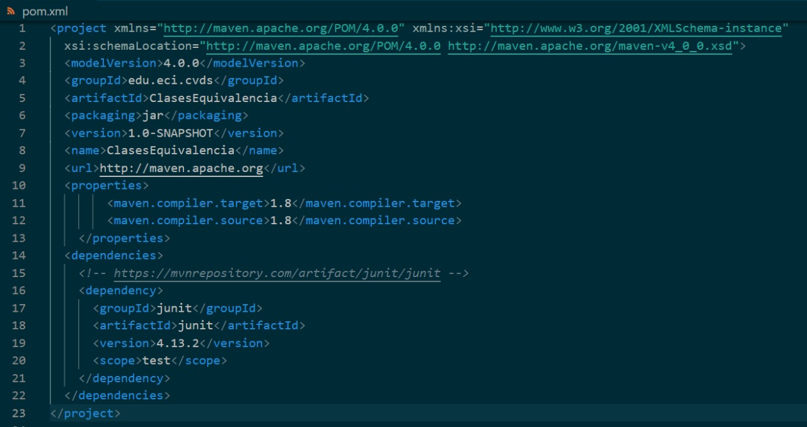
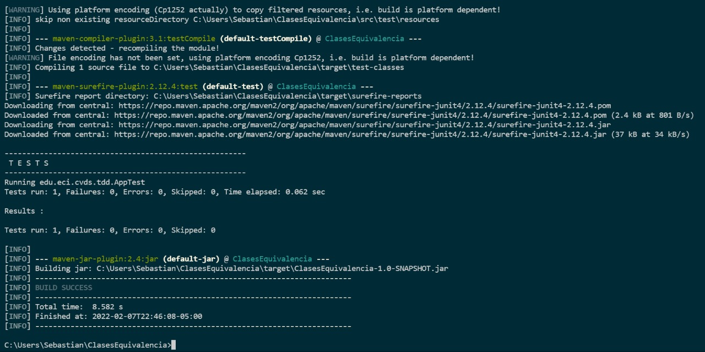
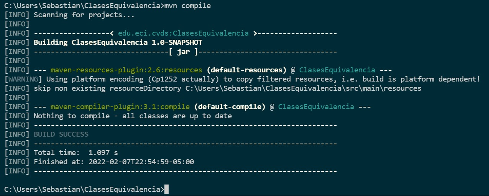
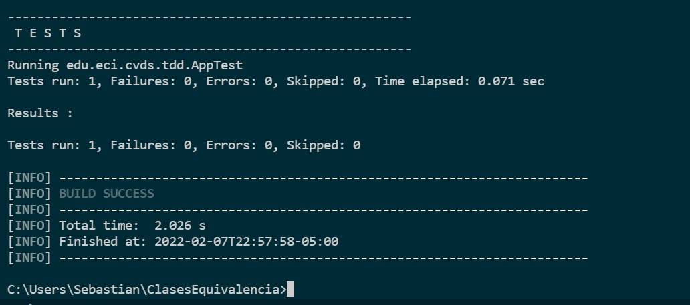
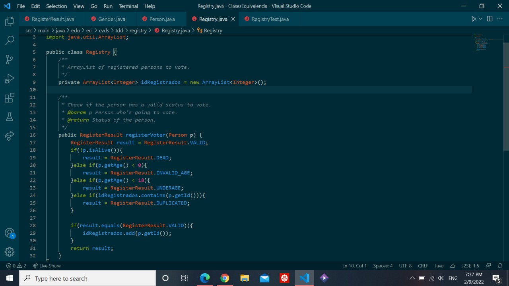
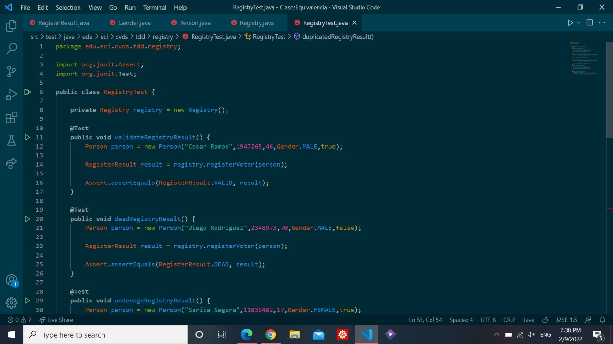
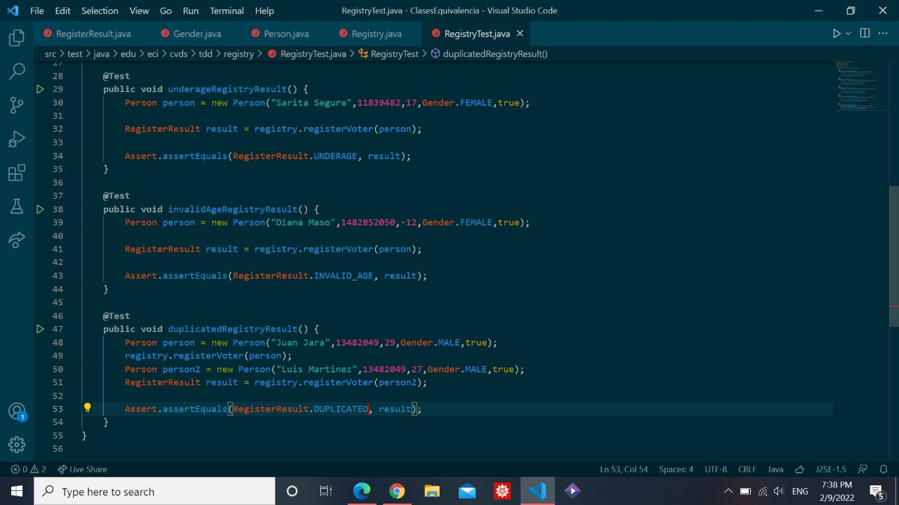
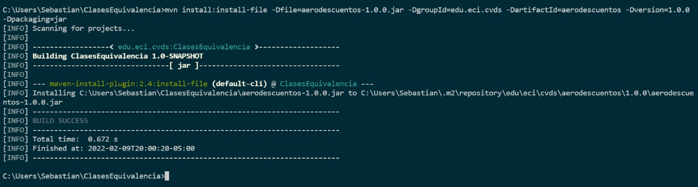
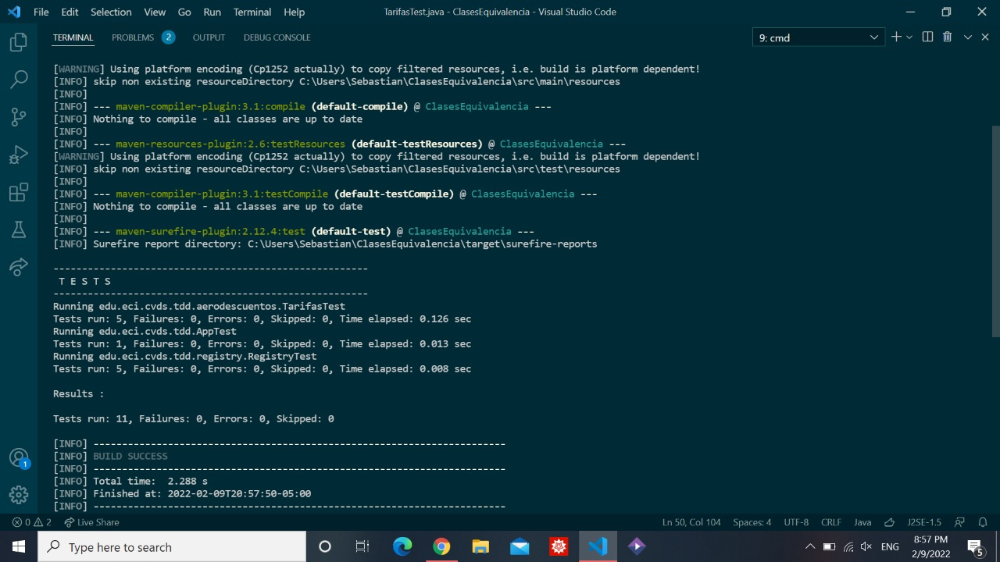

# Laboratorio 3 - TDD
### Juan David Martinez Cardozo - Jhon Sebastian Piñeros
## CLASES DE EQUIVALENCIA

## CREAR UN PORYECTO CON MAVEN
- En el directorio de trabajo ejecutar el comando necesario para crear un proyecto maven, basado en un arquetipo:
- Grupo: edu.eci.cvds
- Artefacto: ClasesEquivalencia
- Paquete: edu.eci.cvds.tdd
- archetypeArtifactId: maven-archetype-quickstart

## ACTUALIZAR Y CREAR DEPENDENCIAS EN EL PROYECTO
- Busque en internet el repositorio central de maven.
- Busque el artefacto JUnit y entre a la versión más nueva
- Ingrese a la pestaña de Maven y haga click en el texto de la dependencia para copiarlo al portapapeles.
- Edite el archivo pom.xml y realice las siguientes actualizaciones:
- Agregue la dependencia copiada a la sección de dependencias.
- Hay que cambiar la versión del compilador de Java a la versión 8, para ello, agregue la sección properties antes de la sección de dependencias:

    <properties>
        <maven.compiler.target>1.8</maven.compiler.target>
        <maven.compiler.source>1.8</maven.compiler.source>
    </properties>

## COMPILAR Y EJECUTAR
- Ejecute los comandos necesarios de Maven, para compilar el proyecto y verificar que el proyecto se creó correctamente y los cambios realizados al archivo pom no generan inconvenientes.

- Busque el comando requerido para ejecutar las pruebas unitarias de un proyecto desde Maven y ejecútelo sobre el proyecto. Se debe ejecutar la clase AppTest con resultado exitoso.

## EJERCICIO “REGISTRADURÍA”
Se va a crear un proyecto base para un requerimiento de la registraduría en el cual se registrarán personas con intención de votar paras las próximas elecciones y se generarán los certificados electorales de aquellas personas cuyo voto sea válido.

Se usará la clase de persona que ya fue creada. El servicio de la registradiría permitirá registrar personas que sean votantes

### PROPIEDADES

- Sólo se registrarán votantes válidos
- Sólo se permite una inscripción por número de documento

## EJECUTAR LAS PRUEBAS
- Para correr las pruebas utilice
$ mvn package

- Tambien puede utilizar:
$ mvn test

-Revise cuál es la diferencia.

La diferencia esque el mvn package empaqueta y muesra el test al final, mientras que mvn test unicamente muestra el test

## FINALIZAR EL EJERCICIO

- Piense en los casos de equivalencia que se pueden generar del ejercicio para la registraduría, dadas las condiciones. Deben ser al menos 5.

- Complete la implementación del método registerVoter en la clase Registry.java para retornar el resultado esperado según la entrada.

- Complete la implementación de la clase RegistryTest.java con (al menos) un método por cada clase de equivalencia, creando diferentes personas y validando que el resultado sea el esperado.

## EJERCICIO "DESCUENTO DE TARIFAS"
### REALIZAR DISEÑO DE PRUEBAS
- Para realizar de forma correcta el diseño de sus pruebas responda las preguntas que se encuentran en el siguiente documento.

### IMPLEMENTACIÓN DE LAS PRUEBAS 
- Descargue el archivo aerodescuentos.jar y adicione esta nueva dependencia en el archivo pom.xml de su proyecto.
Para adicionar una librería personalizada al repositorio local de maven puede ejecutar el siguiente comando.
$ mvn install:install-file -Dfile=aerodescuentos-1.0.0.jar -DgroupId=edu.eci.cvds -DartifactId=aerodescuentos -Dversion=1.0.0 -Dpackaging=jar

- Cree el archivo TarifasTest.java en el directorio src/test/java/edu/eci/cvds/tdd/aerodescuentos.
 Realice la implementación de las pruebas propuestas en la etapa de diseño de pruebas en esta clase. Para sus pruebas debe usar el método "calculoTarifa" de la clase edu.eci.cvds.tdd.aerodescuentos.CalculadorDescuentos, que se encuentran dentro del JAR de la librería personalizada.

- Ejecute el comando de Maven para las fases de compilación y pruebas. Verifique el resultado exitoso de todas las pruebas y el reporte generado.

